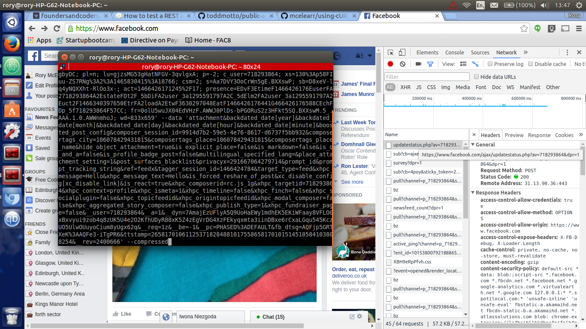

# Using cURL

curl is a command line application that allows you to access websites and carry out API requests from the terminal.
It does something similar to what a browser does but from the terminal.

## General usage

### Navigate to a website
```bash
curl http://www.google.com
```
This will not open a browser but show you the server response (raw HTML) in the terminal.

### Save curls output into a file
```bash
$ curl -o mygettext.html http://www.gnu.org/software/gettext/manual/gettext.html
```
This will save the server response to a file called mygettext.html in your current directory.

### Download a file in current folder
```bash
curl -O http://www.stockvault.net/data/2010/02/04/113039/small.jpg
```
This will save the file small.jpg to the directory you are in.

### Download multiple files
```bash
$ curl -0 http://www.domain.com/{one,two,three}.txt
```
This will save the server responses from the extensions http://www.domain.com/one, http://www.domain.com/two and http://www.domain.com/three

### Check in the dictionary for word
```bash
curl dict://dict.org/d:your_word
```
Some websites are configured to provide a server response from a curl request that looks good in your terminal. Trying copying the command above into the terminal and updating your_word to your favourite word for a definition from dict.org.

## Using cURL to test your API query

One useful way to use curls is to test your API query. Type curl, then -X, then the request type and the result will be returned in the terminal.
```bash
curl -X GET http://www.google.it
curl -X POST http://www.google.it
```
If you dont specify anything as in the first example curl defaults to GET

## TUTORIAL - make a post request on a dummy server

Let's try a POST request:

* Server that accepts post and put requests

http://posttestserver.com

* The endpoint to make a post request is

http://posttestserver.com/post.php

* Pass the variable dir to save in a specific folder. The beginning of the parameters is marked by a question mark.

http://posttestserver.com/post.php?dir=myfolderName

* To pass the values that you want to save, use option -d of curl. Try to write the curl command by your self. The solution is just few lines below:

```bash
curl -i -X POST http://www.posttestserver.com/post.php?dir=myDir -d '{"value":"my message"}'
```
Now you content is saved in the folder. To access it use the link provided in the response message

## TUTORIAL - hack facebook with curl

Lets update our facebook page using cURL with help from the Chrome Inspector.

* Open up facebook and enter a new status but don't press 'post'. Open up the chrome inspector and go to the 'Network' tab. Network keeps a log of all the calls to other files; XHR (the one we're interested in) but also JS and CSS files.


* Press the clear button (the one next to the red circle) which will remove all of the calls which have happened up to that point. Now press 'post' to post your status to your facebook wall.


* On the righthand side, a new call should have appeared called updatestatus.php

* If you tried to POST directly (like we did in our first tutorial), the request would fail because you do not have an access key. But we can use the Chrome Inspector to send a cURL request with the right permissions.

* Right-click on the XHR request in the Network tab in the Chrome Inspector and select 'Copy as cURL'. Delete your status update on facebook.

* Open your terminal and paste in the cURL request you have just copied to the clipboard. Hit enter in the terminal to send the API POST request and refresh your browser.



* Congratulations, you just updated Facebook from the command line.

* If you're feeling bold, you can even change the message that you post by going to the part of the cURL request with the message tag and changing the message text.
