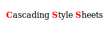

# CSS Basics

### What is CSS

Cascading Style Sheets (CSS) is a language for specifying how documents are presented to users. These documents are written in a markup language such as HTML.

### How CSS Works

CSS works by applying styles and providing formatting advice to your browser when it reads and displays HTML. These styles can exist within style tags as in the example below:

```html
<html>
<head>
<style>
h1 {color:red;}
p {color:blue;}
</style>
</head>
<body>

<h1>A heading</h1>
<p>A paragraph.</p>

</body>
</html>

```
In this example, font colors styles are being applied to the h1 and p elements within the HTML. This is normally not done because style tags embedded within the HTML are more difficult to edit and audit than if they are separated into a stylesheet, which contains all of the CSS used to style that page.

#### Exercise 1 Linking to a stylesheet

* Create a new directory on your computer to save and organize the tutorial exercises.

* Open your text editor and create a new text file. This file will contain the document for the next few tutorial exercises.

* Copy and paste the HTML shown below. Save the file using the name doc1.html

```html
<!DOCTYPE html>
<html>
  <head>
  <meta charset="UTF-8">
  <title>Sample document</title>
  <link rel="stylesheet" href="style1.css">
  </head>

  <body>
    <p>
      <strong>C</strong>ascading
      <strong>S</strong>tyle
      <strong>S</strong>heets
    </p>
  </body>
</html>

```
* Create another text file in the same directory as the doc1.html document you created in the first section.
Save your document as: style1.css. This file will be your stylesheet.

* In your CSS file, copy and paste this one line, then save the file:

```css
strong {color: red;}
```

* Now open doc1.html in your browser by copying in the directory and file name into the URL bar. You should see:



### Cascading and Inheritance

### Selectors

#### Readable CSS

### Text Styles

### Color

### Content

### Lists

### Boxes

### Layout

### Tables

### Media
