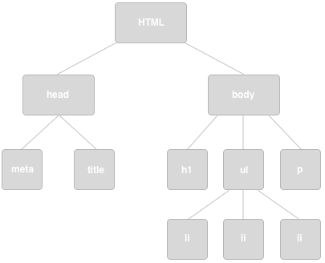

# Manipulating the DOM

  
_The structure of a web page_

## Nodes

The three most important DOM nodes are:

###Element Nodes
An element node represents an element within a page: `
`, `<ul>`, `
`, etc. The tag provides an elements' name, so `
` elements have the name `p`, `<ul>` elements `ul`, and so on. Elements can contain other elements – which makes sense when you think about it. The only element on a HTML document which isn't contained in another is `<html>`; that means `<html>` makes up the root of our node tree.

###Text Nodes
As the name suggests, a text node represents text. If you have some code that reads `
This is a text node
`, it consists of a text node – `This is a text node` – contained within an element node – the `
`. Text nodes are always enclosed within element nodes, but not all elements contain text nodes! Most of the time, for instance, a `<ul>` element will only contain `<li>` elements.

###Attribute Nodes
You use an attribute to give more specific information about an element; `id`, `class`, `title` and `src` are all attributes. Like text nodes, an attribute node is always contained within an element.

So in the code block:

`

	Element and Text and Attribute Nodes – oh my!

`

* `

` is an **element node**
* `Element and Text and Attribute Nodes – oh my!` is a **text node**
* `id="attribute"` is an **attribute node**
